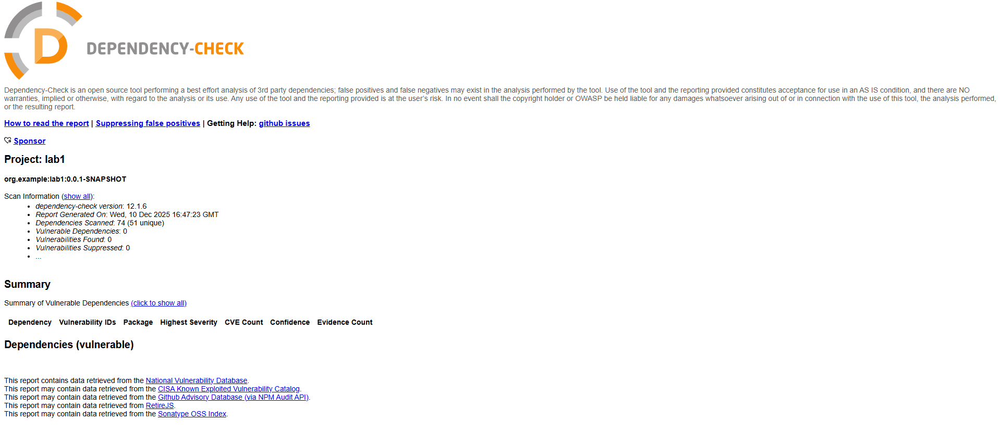
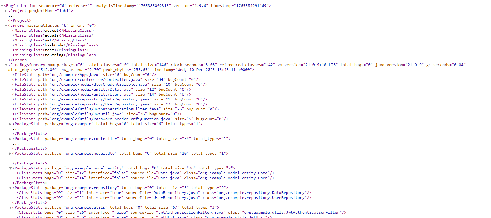

Безопасное backend-приложение с автоматизированной проверкой кода на уязвимости.

### API:

1) POST /auth/login — метод для аутентификации пользователя (принимает логин и пароль).
2) POST /auth/login — метод для аутентификации пользователя (принимает логин и пароль).
3) GET /api/data — метод для получения данных. Доступ только у аутентифицированных пользователей.

### Использованные меры защиты:
1) SQL-инъекции -  использование ORM Hibernate
2) XSS - экранирование данных с помощью HtmlUtils
3) Broken Authentication - использование Jwt-токенов и хэширование паролей

### Отчеты из pipeline

Dependency-check:

Spotbugs:

